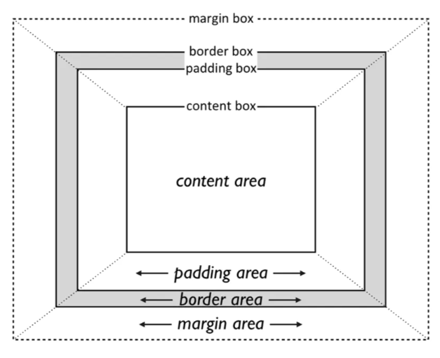

## 1. 基本的元素Box

每个文档中的元素都会生成一个长方形的box，无论是否可见，总会生成。这个box被称为**element box**.**element box**具有排他性，默认情况下，同一个层级不允许有多个box重叠。（不设置布局相关属性，默认情况下）



每个盒子都有四部分:
- content
- padding
- border
- margin

所以盒子也可以看做四种形式:
- content-box
    + 其中只有content
- padding-box
    + content + padding
- border-box
    + content + padding + border
- margin-box
    + content + padding + border + margin

注: 每个盒子都有四个部分，这四种形式的盒子只是看待的角度不同，并不是说就没有其他部分。

### width 和 height属性

这两个属性用于设置盒子的宽度和高度。

`width`: 盒子的宽度，默认值为`auto`
`height`: 盒子的高度 默认值为`auto`

**注:** 对于文档流中的inline的不可替代元素，如span，i等元素，他们不起作用。

默认情况下，width和height是设置**content-box**的宽高.如果需要改变这个默认行为需要使用**box-sizing**属性.

### padding 属性

padding属性的默认值依据元素的不同而不同。但是因为实际情况下基本都会被初始化为0，所以也可以看做0.

```css
padding: 10px[top] 20px[right] 15px[bottom] 5px[left];
```

padding属性应用规则：
如果定义了padding属性，以如下规则应用:
1. 如果`left`值没有定义，那么就是用`right`的值
2. 如果`bottom`值没有定义，就使用`top`的值
3. 如果`right`值没有定义，就使用`top`的值

总之，左看右，下看上。

单侧padding：可以单独指定每一侧的padding

- padding-top
- padding-right
- padding-bottom
- padding-left

**注:** padding 不能为负值

#### padding 中的百分比数值

默认情况下参照的是包含块width进行计算。其他情况待试验考证。

#### padding 应用于内联不可替代元素

`padding-top`和`padding-bottom`可以设置，但是并不改变元素的高度。换句话说，上下的padding不影响布局。
`padding-left`和`padding-right`可以正常生效.

#### padding 应用于可替代元素

对于可替代元素如img，padding的表现和对block元素的表现是一致的。

### border属性

border有三个要素:
- 宽度
    + 默认值 medium 一般来说2px
    + border-width
- 颜色
    + 默认值是盒子内容区的前景色
    + border-color
- 样式
    + 未定义，none居多
    + 一般来说，这个值是必须被设置的，因为不设置边框根本不会显示
    + border-style

border有四条边，所以每条边都可以设置边框:
- border-top
- border-right
- border-bottom
- border-left

应用规则和padding一样。都是下看上，左看右。border是一次设置四条边。默认情况下，background的边界就是border的边界。

```css
border: width color style[三者没有顺序];
```

#### border-style

CSS预定义了10种边框样式:

- none
- hidden
    + 这两个样式边框不会显示
- solid
    + 实线，最长使用
- double
    + 双线
    + 最是难用，因为border-width作用的是双线中间空白的宽度，而双线本身宽度依赖浏览器自身实现
- dotted
- dashed
    + 虚线
- groove
- ridge
- inset
- outset

##### 四条边一起设置

```css
border-style: solid dashed dotted sold; /* 使用方式同border */
```

##### 单侧样式

- border-top-style
- border-right-style
- border-bottom-style
- border-left-style

所有的单侧样式初始值都是`none`.

#### border-width

边框宽度同样有单侧的:

- border-top-width
- border-right-width
- border-bottom-width
- border-left-width

默认值medium，一般为2px。

#### border-color

单侧颜色:

- border-top-color
- border-right-color
- border-bottom-color
- border-left-color

默认值是当前元素的前景色。

#### 如何让border不可见

1. 如果需要border有宽度，但是不可见

```css
border-color: transparent;
```

2. 如果需要border没有宽度，也不可见

```css
border-style: none;
```

#### 内联元素的border

对于不可替代元素，上下border不会改变布局，左右border正常显示。
对于可替代元素，其效果同block元素。

#### border-radius

圆角边框，其默认值为0.border-radius是同时设置四个角的属性.

```css
border-radius: 2em;
border-radius: 1em /* Top Left */
2em /* Top Right */ 3em /* Bottom Right */ 4em; 

border-radius: 1em 2em 3em 4em / 5em 6em 7em 8em;

```

border有四个角，所以同样也有分别设置4个角的属性。

- border-top-left-raidus
- border-top-right-radius
- border-bottom-right-radius
- border-bottom-left-radius

对于每个角来说，有两个值来决定这个角到底有多圆，分别是x-radius和y-radius.这两个值指定了椭圆的长轴短轴。

对于border-radius来说，参考是对角。顺序是左上，右上，右下，左下。
border-radius实际上修改的是border和background的渲染，而不是盒子模型本身。盒子模型本身还是站矩形那么大的位置。

#### border-image系列

要使用图片作为border，前提是必须设置border-style和border-width.否则border-image系列不会生效.

- border-image-source
    + 指定图片的url
- border-image-slice
    + 默认值100%
    + 可以接收4个值，遵守top,right,bottom, left的顺序
    + 设置图片裁切范围用于设置边框
    + slice属性的不同百分比对应不同的边缘裁切效果
- border-image-width
    + 默认值为1 表示image的实际区域将由border-width来决定
    + 用于指定使用多厚的边框来承载被裁剪后的图像，如果不设置，默认使用border-width
    + 如果该值设置为auto，则使用border-image-slice的值
- border-image-outset
    + 默认值0
    + 指定边框图像向外扩展所定义的数值
- border-image-repeat
    + 默认是strech 拉伸图片
    + 取值:
        * strech - 如果图片不够长或者不够宽，拉伸图片
        * repeat - 重复图片
        * round - 根据边框的宽度和图片的大小，自动做计算然后拉伸。保证图片是完整的
        * space - 和round差不多，都做了四舍五入操作，图片向下舍去以保证不形变


border-image的简写属性如下:

```css
border-image: border-image-source border-image-slice / border-image-width / border-image-outset / border-image-repeat;
```

除了border-image-source之外，另外四个属性因为都可以写多个值所以需要用/分割。

### outlines

outline是在border的外部直接渲染。

outline和border外观上基本相同.
- outline-width
- outline-style
- outline-color

缩略写法:

```css
outline: outline-width outline-style outline-color
```

与border的主要区别: **outline不影响layout**

### margin

margin是不可见的，它的主要作用还是用于布局。同样margin也有四条边

- margin-top
- margin-right
- margin-bottom
- margin-left

默认值为0.

#### margin collapsing冲突

即所谓的外边距重叠现象。
- 对于兄弟元素，他们的上下外边距会发生重叠现象
    + 如果两个元素的外边距都是正值，则取值较大的
    + 如果两个元素的外边距都是负值，则取绝对值较大的
    + 如果两个元素的外边距一正一负，则取他们的和
- 对于父子元素，如果他们是紧挨的，则子元素的外边距会传递给负外边距。通常通过clearfix解决。

#### inline元素的margin

对于不可替代元素来说，上下的marigin不起作用，左右margin正常生效。
对于可替换元素来说，上下左右margin都生效.

**总结**：
- width, height
    + 对于block元素，默认是调整content-box的宽和高
    + 对于inline-block,调整content-box的宽和高
    + 对于inline元素，不起作用
- padding,margin
    + inline-block正常生效
    + inline 上下不影响布局，左右正常生效
- border
    + 可替换元素正常生效
    + inline不可替换元素左右生效，上下不影响布局
